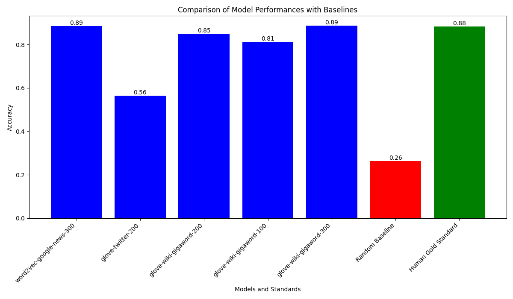
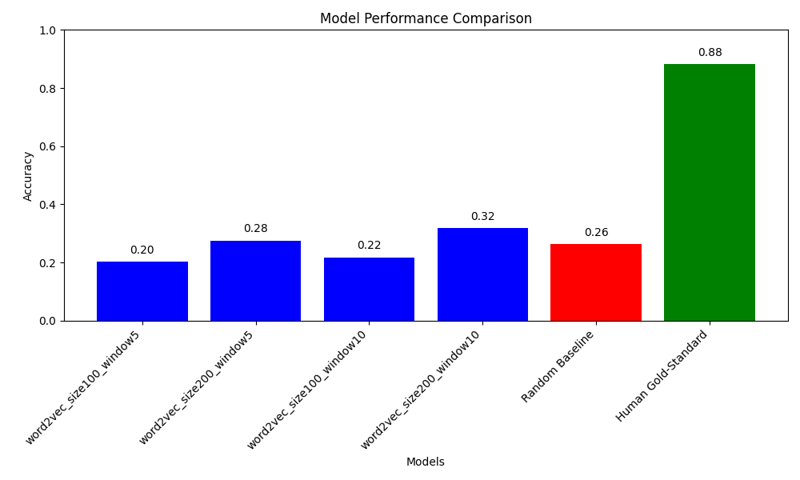

# AI Assignment 2 - COMP 472

## Introduction
This project explores Natural Language Processing (NLP) through the application of various word embeddings using the word2vec library. It was developed for the Artificial Intelligence Class COMP 472.

## Team Members
- Team Lead: Christopher Lopez (40199547)
- Kim Wei Kevin Chan (40176896)
- Xin Jia Cao (40207469)

## How to Run the Program
`assignment2.py`: Script for Tasks 1 & 2: Pre-trained Models & Comparison with other Pre-trained Models

`train_word2vec.py`: Script for Task 3: Training our own Models

## Model Performance Comparison (Task 2)

The following graph compares Pre-trained Models

The following graph shows the performance of different Word2Vec models compared to a random baseline and the human gold-standard.

### Analysis

This section compares 2 models from different corpora, but same embedding size and  models from the same corpus, but different embedding size.

### Different Corpora
We can see that the accuracy of glove-twitter-200 is much lower that glove-wiki-gigaword-200. This is probably because Twitter contains a lot of slang, abbreviations, and informal language. This might make it less suitable for tasks that require understanding of standard or formal vocabulary compared to the glove-wiki-gigaword-200 model, which is trained on text from Wikipedia, a more formal and curated dataset.

### Different Embeddings
We can see that the accuracy of glove-wiki-300 is higher that glove-wiki-100. This is expected because with 300 dimensions, the glove-wiki-gigaword-300 model can encode more subtle differences between words, which may be crucial for synonym detection where distinctions can be subtle.

### Human Gold Standard
The human gold standard represents the upper limit of performance. Glove-wiki-giga-300 has an even higher accuracy than the human gold standard, which means the the model is quite effective.

## Analysis (Task 3)

This section compares Word2Vec models trained on our own corpus with varying embedding sizes and window sizes.

### Different Embedding Sizes
-The models trained with 200-dimensional embeddings (your_own_corpus-E200-W5 and your_own_corpus-E200-W10) consistently outperformed those with 100-dimensional embeddings (your_own_corpus-E100-W5 and your_own_corpus-E100-W10), achieving an accuracy of approximately 29%. This improvement underscores the capacity of larger embedding sizes to capture more nuanced semantic relationships, which is critical for the synonym detection task.

### Different Window Sizes
Comparing the models with different window sizes but the same embedding dimensions, we observe that the window size does not significantly affect the accuracy. Both your_own_corpus-E100-W5 and your_own_corpus-E100-W10 models yielded an accuracy of about 23%, and similarly, your_own_corpus-E200-W5 and your_own_corpus-E200-W10 both achieved around 29% accuracy. This suggests that within the context of our training corpus, the window size—representing the context scope for training—has a less pronounced effect than the embedding size.

### Summary
Our analysis indicates that increasing the embedding size has a beneficial impact on the model's ability to discern synonyms within our corpus. In contrast, variations in window size did not demonstrate a noticeable difference, implying that for our specific dataset and NLP task, the embedding size is a more crucial factor than the contextual window.
