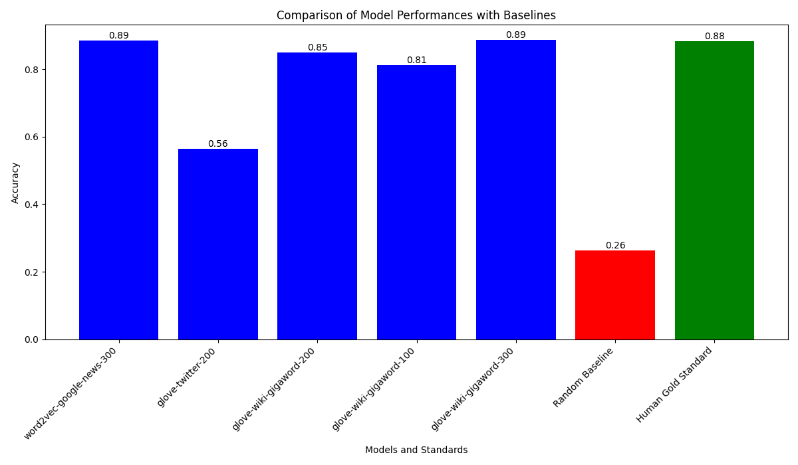

# AI Assignment 2 - COMP 472

## Introduction
This project explores Natural Language Processing (NLP) through the application of various word embeddings using the word2vec library. It was developed for the Artificial Intelligence Class COMP 472.

## Team Members
- Team Lead: Christopher Lopez (40199547)
- Kim Wei Kevin Chan (40176896)
- Xin Jia Cao (40207469)

## How to Run the Program
`assignment2.py`: Script for Tasks 1 & 2: Pre-trained Models & Comparison with other Pre-trained Models

`train_word2vec.py`: Script for Task 3: Training our own Models

# Model Performance Comparison

The following graph compares Pre-trained Models

The following graph shows the performance of different Word2Vec models compared to a random baseline and the human gold-standard.

## Analysis

This section compares 2 models from different corpora, but same embedding size and  models from the same corpus, but different embedding size.

### Different Corpora
We can see that the accuracy of glove-twitter-200 is much lower that glove-wiki-gigaword-200. This is probably because Twitter contains a lot of slang, abbreviations, and informal language. This might make it less suitable for tasks that require understanding of standard or formal vocabulary compared to the glove-wiki-gigaword-200 model, which is trained on text from Wikipedia, a more formal and curated dataset.

### Different Embeddings

## Analysis

This section presents a comparative analysis of various Word2Vec models against a random baseline and a gold standard, focusing on their accuracy in synonym detection tasks.

### Performance Benchmarks
- **Random Baseline**: 
  - **Accuracy**: 26.25%
  - Serves as a basic benchmark for random guesswork.
- **Gold Standard**:
  - **Accuracy**: 88.28%
  - Sets a high-performance target.

### Word2Vec Model Evaluations

1. **word2vec_size100_window5**
   - **Vocabulary Size**: 45,104
   - **Accuracy**: 20.29% (14/69 correct)
   - **Analysis**: Underperforms compared to the random baseline, suggesting limitations due to the smaller vector size and window size.

2. **word2vec_size200_window5**
   - **Vocabulary Size**: 45,104
   - **Accuracy**: 27.54% (19/69 correct)
   - **Analysis**: Shows improvement over the previous model, exceeding the random baseline slightly. Indicates a positive impact of a larger vector size.

3. **word2vec_size100_window10**
   - **Vocabulary Size**: 45,104
   - **Accuracy**: 21.74% (15/69 correct)
   - **Analysis**: Minor improvement over the size100_window5 model but still below the random baseline. Increased window size does not significantly enhance performance.

4. **word2vec_size200_window10**
   - **Vocabulary Size**: 45,104
   - **Accuracy**: 31.88% (22/69 correct)
   - **Analysis**: The best performer among the tested models. A larger vector size and window size contribute positively, achieving an accuracy above the random baseline. However, it still significantly lags behind the gold standard.

### Conclusion
The analysis reveals that larger vector sizes and window sizes can improve Word2Vec models' performance in synonym detection tasks. However, despite these improvements, all models substantially trail the gold standard. This gap underscores the necessity for further optimizations, such as parameter tuning, using more extensive training data, or exploring different modeling techniques.
