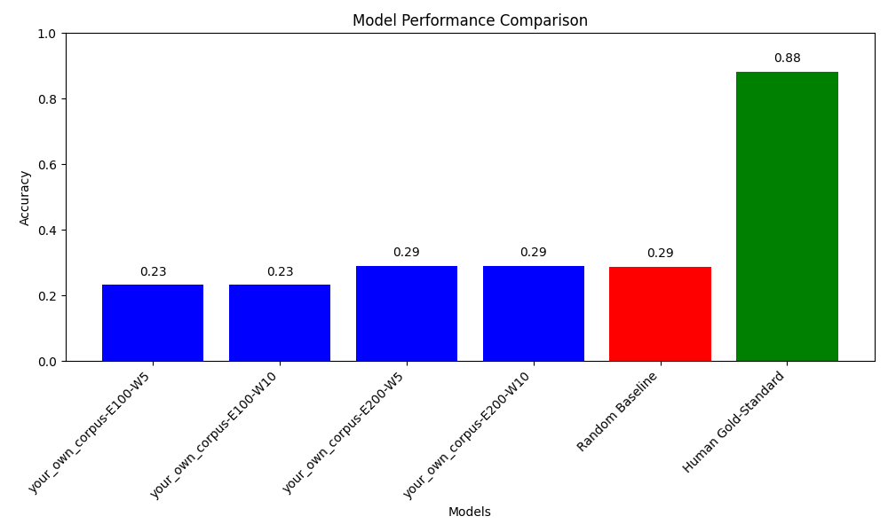

# AI Assignment 1 - COMP 472

## Introduction
This project explores Natural Language Processing (NLP) through the application of various word embeddings using the word2vec library. It was developed for the Artificial Intelligence Class COMP 472.

## Team Members
- Team Lead: Christopher Lopez (40199547)
- Kim Wei Kevin Chan (40176896)
- Xin Jia Cao (40207469)

## How to Run the Program
`assignment2.py`: Script for Tasks 1 & 2: Pre-trained Models & Comparison with other Pre-trained Models

`train_word2vec.py`: Script for Task 3: Training our own Models

# Model Performance Comparison

The following graph shows the performance of different Word2Vec models compared to a random baseline and the human gold-standard.

## Analysis

The graph above indicates that the models with a window size of 10 (word2vec_size100_window10 and word2vec_size200_window10) generally outperformed those with a window size of 5. This suggests that a larger context window may help the model capture more relevant semantic information for the task of synonym detection.

Compared to the random baseline, all models showed a significant improvement, indicating that the Word2Vec embeddings do capture meaningful semantic relationships. However, there is still a considerable gap compared to the human gold-standard, which could be due to several factors, such as the complexity of human language understanding and the limitations of the training corpus.

Further improvements could be made by expanding the training corpus, fine-tuning the model hyperparameters, or exploring more advanced language models.
